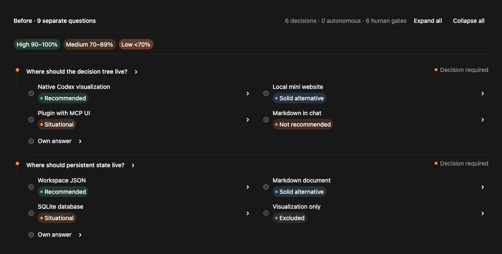
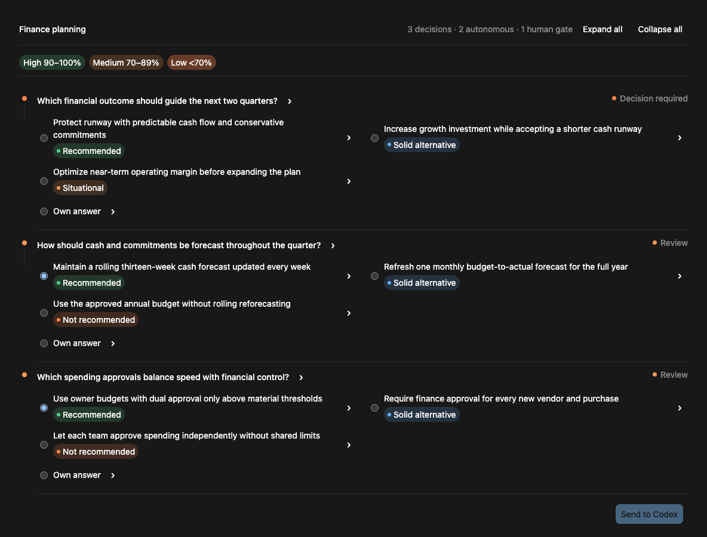
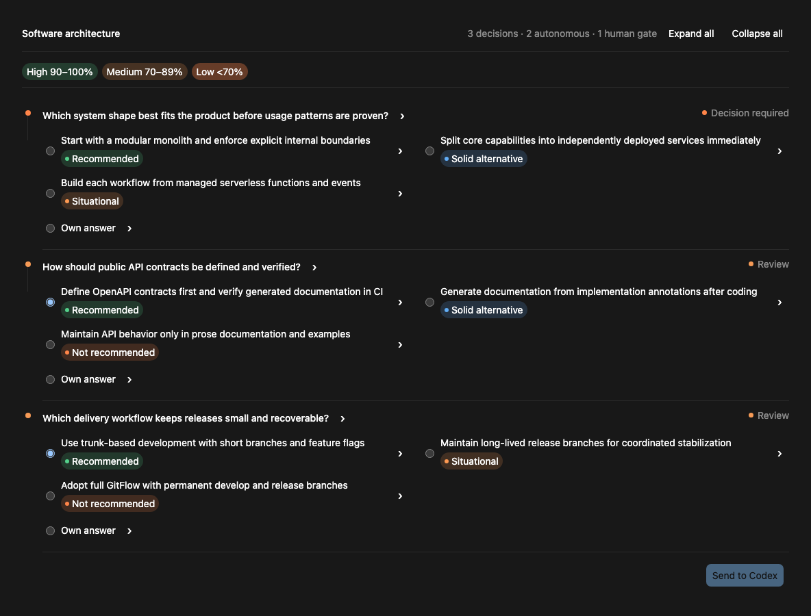
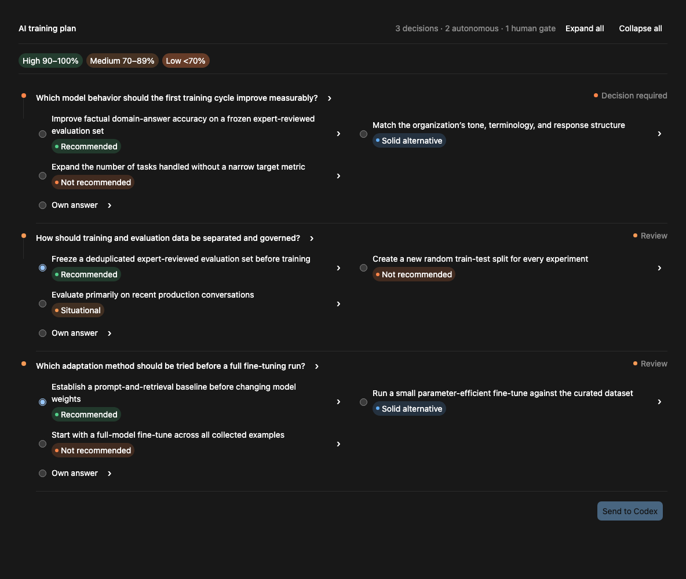
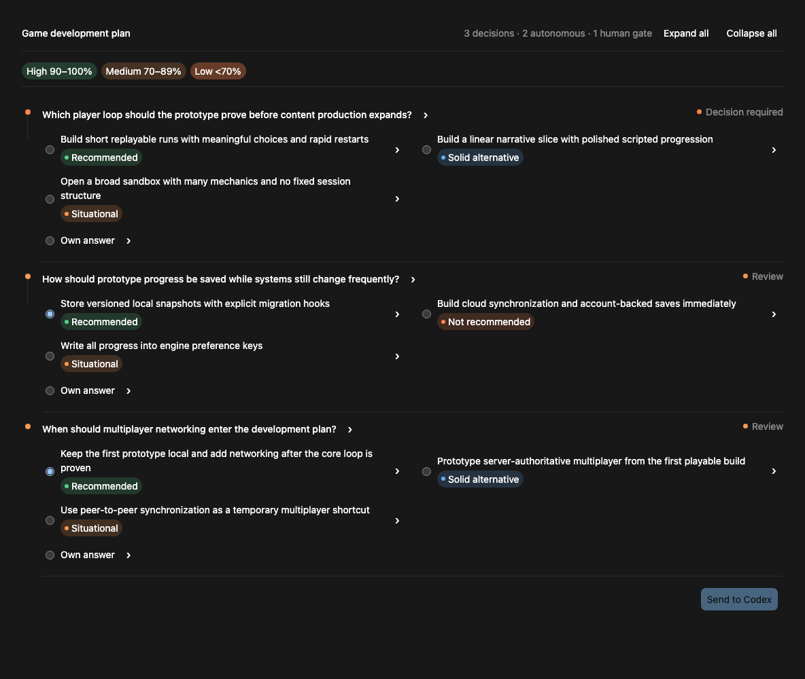
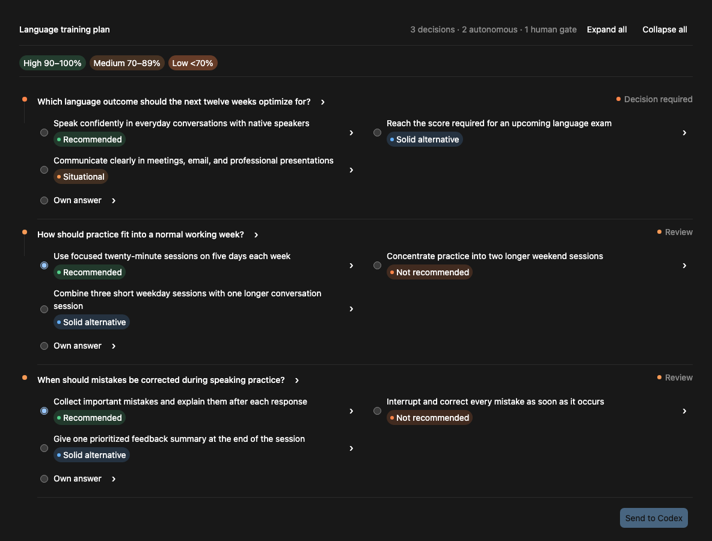
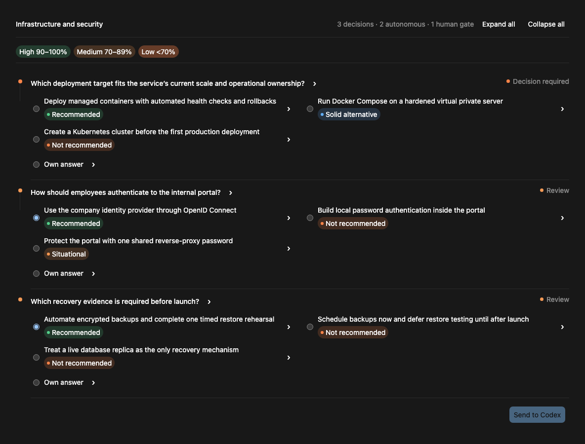

# Let Him Grill

[English](README.md) · **Deutsch**

Eine autonome, evidenzbasierte Erweiterung des Grill-with-Docs-Workflows für
Codex. Sie löst sichere, umkehrbare Entscheidungen selbstständig und stoppt,
wenn menschliches Urteilsvermögen das Ergebnis wesentlich beeinflusst.

<p align="center">
  
</p>

<p align="center"><strong>Molebyte baut die umkehrbaren Zweige. Die wichtigen Entscheidungen bleiben bei dir.</strong></p>

## Demo



Sechs Entscheidungen bewertet · fünf autonom gelöst · ein menschlicher
Entscheidungspunkt. Das [Posterbild](docs/demo-poster.png) dient als statische
Alternative.

## Installation

```bash
npx skills add pengusto/let-him-grill -g -a codex -y
```

Starte nach der Installation einen neuen Codex-Task und rufe anschließend
`$let-him-grill` auf.

## Vorher und nachher

In fünf skriptgesteuerten paarweisen Planungsdurchläufen sank die mediane Zeit
bis zu einem nutzbaren Plan von 455 auf 54 Sekunden. Die finalen Pläne von Let
Him Grill zeigten sieben normalisierte wesentliche menschliche
Entscheidungspunkte und stellten eine unmittelbar zu beantwortende Frage. Siehe
[Protokoll, Rohtranskripte und Einschränkungen](docs/benchmark/RESULTS.md).

## Funktionsweise


- untersucht Repository-Code und Dokumentation, bevor Fragen gestellt werden
- empfiehlt für jede echte Entscheidung eine Antwort
- bewertet jede Option nach Eignung, Risiko, Aufwand und Umkehrbarkeit
- trifft umkehrbare Entscheidungen mit geringem Risiko automatisch
- stoppt bei Architektur-, Produkt-, Sicherheits-, Kosten- und anderen
  menschlichen Entscheidungspunkten
- erklärt abhängige Entscheidungen für ungültig, wenn sich eine frühere Auswahl
  ändert
- unterstützt kompakte Textausgabe und einen dauerhaften interaktiven
  Entscheidungsbaum

## Manuelle Installation

Nutze Git als Ausweichlösung, wenn die `skills`-CLI nicht verfügbar ist. Beide
Modi verwenden dieselbe Installation; der Modus wird beim Aufruf des Skills
gewählt.

### Globale Installation

Für den aktuellen Benutzer in jedem Codex-Projekt verfügbar:

```bash
mkdir -p ~/.agents/skills
git clone https://github.com/pengusto/let-him-grill.git \
  ~/.agents/skills/let-him-grill
```

PowerShell:

```powershell
New-Item -ItemType Directory -Force "$HOME\.agents\skills" | Out-Null
git clone https://github.com/pengusto/let-him-grill.git `
  "$HOME\.agents\skills\let-him-grill"
```

### Projektlokale Installation

Versioniere den Skill zusammen mit einem Repository:

```bash
mkdir -p .agents/skills
git submodule add https://github.com/pengusto/let-him-grill.git \
  .agents/skills/let-him-grill
```

Starte nach der Installation einen neuen Codex-Task, damit der Skill erkannt
wird.

## Verwendung

### Kompaktmodus

Textorientiert. Status und Visualisierung werden nur erstellt, wenn sie durch
Verzweigungen oder erneut betrachtete Entscheidungen nützlich werden.

```text
Nutze $let-him-grill im Kompaktmodus, um diesen Plan einem Stresstest zu
unterziehen. Fahre autonom fort, bis meine Entscheidung erforderlich ist.
```

### Visueller Modus

Speichert Entscheidungen in `.grill/decisions.json` und zeigt den interaktiven
Baum an menschlichen Entscheidungspunkten sowie nach Änderungen.

```text
Nutze $let-him-grill im visuellen Modus, um diesen Plan einem Stresstest zu
unterziehen. Fahre autonom fort, bis meine Entscheidung erforderlich ist.
```

Der visuelle Modus verwendet nach Möglichkeit das Python-Backend aus der
Standardbibliothek und weicht andernfalls auf native Datei- und
Visualisierungswerkzeuge von Codex aus. Beide Backends befüllen dieselbe
mitgelieferte HTML-Vorlage, sodass die Oberfläche unabhängig vom Renderer
gleich bleibt. Explizite Auswahl:

```text
Nutze $let-him-grill im visuellen Modus mit dem Python-Backend.
```

```text
Nutze $let-him-grill im visuellen Modus mit dem nativen Codex-Fallback. Verwende
weder Python noch eine andere Laufzeitumgebung.
```

Codex zeigt vor der ersten Entscheidung `Visual mode · Python backend` oder
`Visual mode · Native Codex fallback` an.

### Automatische Modusauswahl

```text
Nutze $let-him-grill im am besten geeigneten Modus, um diesen Plan einem
Stresstest zu unterziehen, bis meine Entscheidung erforderlich ist.
```

Codex wählt den Kompaktmodus für kurze lineare Diskussionen und den visuellen
Modus für verzweigte oder erneut betrachtete Entscheidungen. Der gewählte Modus
wird einmal genannt. Ein Wechsel ist jederzeit möglich.

### Beispiel-Prompts

#### Finanzen

`Nutze $let-him-grill, um einen Budgetierungs- und Berichtsansatz für unser
SaaS-Unternehmen auszuwählen. Stoppe vor Compliance- oder Ausgabenentscheidungen.`

Beispielentscheidungen: finanzielle Priorität, Prognoserhythmus und
Ausgabenfreigaben.



#### Softwarearchitektur

`Nutze $let-him-grill, um zu entscheiden, ob dieses B2B-Produkt als modularer
Monolith oder mit getrennten Services starten soll. Stoppe bei wesentlichen
Skalierungs- oder Verantwortungsabwägungen.`

Beispielentscheidungen: Systemstruktur, API-Verträge und Auslieferungsprozess.



#### KI-Training

`Nutze $let-him-grill, um einen Trainingsworkflow für ein domänenspezifisches
Modell zu planen. Stoppe bei Datenschutz-, Lizenz- oder Budgetfragen.`

Beispielentscheidungen: messbares Ziel, Verwaltung der Evaluationsdaten und die
erste zu testende Anpassungsmethode.



#### Spieleentwicklung

`Nutze $let-him-grill, um das Speichersystem und den Mehrspielerumfang dieses
Spielprototyps festzulegen. Stoppe, wenn Plattform-, Netzwerk- oder
Spielerlebnisziele voneinander abweichen.`

Beispielentscheidungen: zentrale Spielschleife, Speicherformat und Zeitpunkt
für den Mehrspielermodus.



#### Sprachtraining

`Nutze $let-him-grill, um einen zwölfwöchigen Sprachtrainingsplan zu erstellen.
Fahre fort, bis Motivation, Zertifizierung oder berufliche Prioritäten mein
Urteil erfordern.`

Beispielentscheidungen: primäres Lernziel, wöchentlicher Übungsrhythmus und
Zeitpunkt der Korrektur bei Sprechübungen.



#### Infrastruktur und Sicherheit

`Nutze $let-him-grill, um Deployment, Authentifizierung, Backups und
Beobachtbarkeit für dieses interne Portal auszuwählen. Stoppe, bevor
Sicherheitsrisiken oder laufende Kosten akzeptiert werden.`

Beispielentscheidungen: Deployment-Ziel, Mitarbeiterauthentifizierung und vor
dem Start erforderliche Wiederherstellungsnachweise.



### Abschluss des Grills

Sobald ein gemeinsames Verständnis erreicht ist, fasst Codex bestätigte
menschliche Entscheidungen, vorläufige KI-Entscheidungen, Annahmen, verbleibende
Risiken oder Blocker sowie den geordneten Implementierungsplan zusammen. Vor der
Implementierung wird eine Bestätigung eingeholt.

Nach der Bestätigung aktualisiert Codex ein bestehendes maßgebliches Planungs-,
Spezifikations- oder Entscheidungsdokument, sofern das Repository bereits eines
verwendet oder Dokumentation angefordert wurde. Standardmäßig wird keine
doppelte Plandatei erstellt.

## Sicherheit und Voraussetzungen

- Codex mit Skill-Unterstützung
- Node.js mit `npx` für den primären Installationsbefehl
- Git nur für die manuelle Installation als Ausweichlösung
- Python 3 empfohlen für deterministische visuelle Statusaktualisierungen
- keine virtuelle Umgebung, kein `pip install`, kein Server und kein
  Netzwerkdienst

Der Kompaktmodus funktioniert ohne Python. Der native visuelle Fallback wendet
über die Codex-Dateiwerkzeuge dieselben Status- und Invalidierungsregeln an,
bietet aber nicht die ausführbare Validierung des Python-Backends. Hosts ohne
Unterstützung für eingebettete Visualisierungen geben dieselben
Entscheidungsinhalte als Text aus.

## Aktualisierung

Globale Installation:

```bash
git -C ~/.agents/skills/let-him-grill pull --ff-only
```

Projektlokales Submodul:

```bash
git submodule update --remote --merge \
  .agents/skills/let-him-grill
```

## Entwicklung

```bash
python3 scripts/test_decision_state.py
```

Die Status-Engine verwendet ausschließlich die Python-Standardbibliothek.
Siehe [Roadmap](docs/ROADMAP.md) für den Start und weitere Arbeiten.
Benutzerrelevante Änderungen werden im [Changelog](CHANGELOG.md) dokumentiert.

## Namensnennung

Inspiriert von Matt Pococks
[Grill with Docs](https://github.com/mattpocock/skills/tree/main/skills/engineering/grill-with-docs)-Workflow.
Let Him Grill ist ein unabhängiges Projekt und weder mit Matt Pocock noch mit
OpenAI verbunden oder von ihnen unterstützt.

## Lizenz

[MIT](LICENSE)
