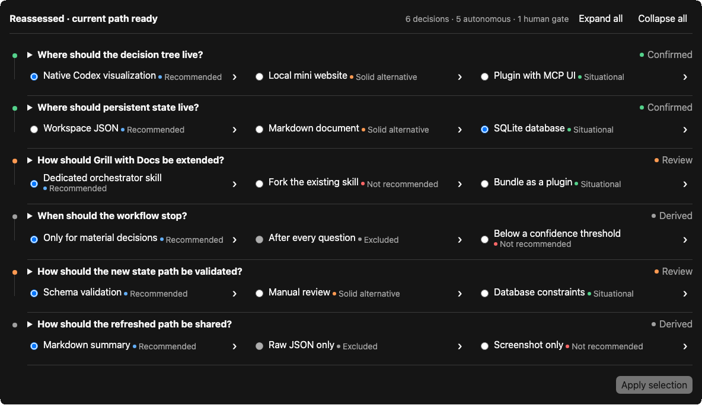

# Let Him Grill

**English** · [Deutsch](README.de.md)

**Stop babysitting Codex. Let it resolve reversible decisions and interrupt you
when your judgment matters.**

Coding agents routinely stop for choices they can safely make themselves. Let
Him Grill researches the repository, recommends and resolves low-risk,
reversible options, records the decision path, and stops at architecture,
product, security, cost, and other material human gates.

## Demo



Six decisions evaluated · five resolved autonomously · one human gate. Compare
the [initial state](docs/demo.png) with the [post-reassessment poster](docs/demo-poster.png),
read the [recorded branch reassessment](docs/examples/feature-planning/reassessment.md),
or inspect a [complete portable decision artifact](docs/examples/README.md).

This is not a blanket `continue autonomously` instruction. Let Him Grill
defines a decision boundary, keeps the portable source of truth in
`.grill/decisions.json`, and invalidates dependent branches when an earlier
choice changes.

## Install

```bash
npx skills add pengusto/let-him-grill -g -a codex -y
```

Start a new Codex task after installation, then invoke `$let-him-grill`.

## Before and after

In five scripted paired planning runs, median time to a usable plan fell from
455 to 54 seconds. Let Him Grill's final plans surfaced seven normalized
material human gates while asking one immediate question. See the
[protocol, raw transcripts, and limitations](docs/benchmark/RESULTS.md). The
timing includes Codex execution and benchmark-controller latency; it is product
evidence, not a controlled model-performance benchmark.

The [clean-install validation](docs/validation/cross-agent-install/README.md)
records Codex discovery and resume behavior plus Claude package installation;
live Claude invocation remains unverified.

## Why not just say “continue autonomously”?

That instruction tells an agent to keep going, but not where to stop or how to
recover when an earlier choice changes. Let Him Grill makes those boundaries
explicit: it classifies decisions, resolves only low-risk reversible options,
stops at genuine Human-Gates, and can resume the portable state in a later
task.

## How it works


- researches repository code and documentation before asking questions
- recommends an answer for every real decision
- triages every option by fit, risk, effort, and reversibility
- continues through reversible, low-risk choices automatically
- stops at architecture, product, security, cost, and other human gates
- invalidates dependent decisions when an earlier choice changes
- supports compact text output and a persistent interactive decision tree

## Manual installation

Use Git as a fallback when the `skills` CLI is unavailable. Both modes use the
same installation; choose the mode when invoking the skill.

### Global installation

Available in every Codex project for the current user:

```bash
mkdir -p ~/.agents/skills
git clone https://github.com/pengusto/let-him-grill.git \
  ~/.agents/skills/let-him-grill
```

PowerShell:

```powershell
New-Item -ItemType Directory -Force "$HOME\.agents\skills" | Out-Null
git clone https://github.com/pengusto/let-him-grill.git `
  "$HOME\.agents\skills\let-him-grill"
```

### Project-local installation

Version the skill with one repository:

```bash
mkdir -p .agents/skills
git submodule add https://github.com/pengusto/let-him-grill.git \
  .agents/skills/let-him-grill
```

Start a new Codex task after installation so the skill is discovered.

## Use

### Compact mode

Text-first. State and visualization are created only when branching or revisiting
decisions makes them useful.

```text
Use $let-him-grill in compact mode to stress-test this plan.
Continue autonomously until my decision is required.
```

### Visual mode

Persists decisions in `.grill/decisions.json` and shows the interactive tree at
human gates and after changes.

```text
Use $let-him-grill in visual mode to stress-test this plan.
Continue autonomously until my decision is required.
```

Visual mode uses the Python standard-library backend when available and falls
back to native Codex file and visualization tools otherwise. Both backends
populate the same bundled HTML template, so the interface does not change with
the renderer. To choose explicitly:

```text
Use $let-him-grill in visual mode with the Python backend.
```

```text
Use $let-him-grill in visual mode with the native Codex fallback. Do not use
Python or another runtime.
```

Codex announces `Visual mode · Python backend` or
`Visual mode · Native Codex fallback` before the first decision.

### Resume a decision artifact

`.grill/decisions.json` is the portable source of truth. In a later task with
Let Him Grill installed, ask the agent to resume that file. The Python backend
can inspect the deterministic next action without changing state:

```bash
python3 <skill-dir>/scripts/decision_state.py resume .grill/decisions.json
```

Resume re-checks provisional AI choices against current repository evidence,
reassesses contradicted or invalidated branches, and continues autonomously to
the next human gate. HTML and Markdown exports are derived views and should be
regenerated in the new workspace.

### Automatic mode selection

```text
Use $let-him-grill in the best fitting mode to stress-test this
plan until my decision is required.
```

Codex chooses compact mode for short linear discussions and visual mode for
branching or revisitable decisions. It states the selected mode once. You can
switch modes at any time.

### Downloadable reference artifacts

Three complete bundles include the starting prompt, portable JSON state,
interactive tree, Markdown handoff, and a documented branch reassessment:

- [Feature planning](docs/examples/feature-planning/README.md)
- [Software architecture](docs/examples/software-architecture/README.md)
- [Release readiness](docs/examples/release-readiness/README.md)

### Example prompts

#### Finance

`Use $let-him-grill to choose a budgeting and reporting approach for our SaaS
business. Stop before compliance or spending decisions.`

Example decisions: financial priority, forecast cadence, and spending approvals.


#### Software architecture

`Use $let-him-grill to decide whether this B2B product should start as a modular
monolith or separate services. Stop at material scaling or ownership trade-offs.`

Example decisions: system shape, API contracts, and delivery workflow.


#### AI training

`Use $let-him-grill to plan a domain-model training workflow. Stop at privacy,
licensing, or budget gates.`

Example decisions: measurable objective, evaluation-data governance, and the
first adaptation method to test.


#### Game development

`Use $let-him-grill to shape the save system and multiplayer scope for this game
prototype. Stop where platform, networking, or player-experience goals differ.`

Example decisions: core player loop, save format, and multiplayer timing.


#### Language training

`Use $let-him-grill to create a twelve-week language training plan. Continue
until motivation, certification, or professional priorities need my judgment.`

Example decisions: primary learning outcome, weekly practice rhythm, and
correction timing during speaking practice.


#### Infrastructure and security

`Use $let-him-grill to choose deployment, authentication, backups, and
observability for this internal portal. Stop before accepting security exposure
or recurring cost.`

Example decisions: deployment target, employee authentication, and recovery
evidence required before launch.


### Finishing the grill

At shared understanding, Codex summarizes confirmed human decisions,
provisional AI choices, assumptions, remaining risks or blockers, and the
ordered implementation plan. It asks for confirmation before implementation.

After confirmation, it updates an existing canonical planning, specification,
or decision document when the repository already uses one or documentation was
requested. It does not create a duplicate plan file by default.

## Safety and requirements

- Codex with skill support
- Node.js with `npx` for the primary installation command
- Git only for the manual installation fallback
- Python 3 recommended for deterministic visual state updates
- no virtual environment, `pip install`, server, or network service

Let Him Grill extends the companion `grilling` and `domain-modeling` skills; it
does not vendor or modify them. The clean-install evidence verifies this
repository's discovery and portable-state path, not every live combination of
companion skills and host runtime.

Compact mode works without Python. The native visual fallback applies the same
state and invalidation rules through Codex file tools, but does not have the
Python backend's executable validation. Hosts without inline visualization
support fall back to the same decision content as text.

## Update

Global installation:

```bash
git -C ~/.agents/skills/let-him-grill pull --ff-only
```

Project-local submodule:

```bash
git submodule update --remote --merge \
  .agents/skills/let-him-grill
```

## Development

```bash
python3 scripts/test_decision_state.py
```

The state engine uses only the Python standard library.
See the [roadmap](docs/ROADMAP.md) for launch and follow-up work.
User-facing changes are tracked in the [changelog](CHANGELOG.md).

## Attribution

Inspired by Matt Pocock's
[Grill with Docs](https://github.com/mattpocock/skills/tree/main/skills/engineering/grill-with-docs)
workflow. Let Him Grill is an independent project and is not affiliated with or
endorsed by Matt Pocock or OpenAI.

## License

[MIT](LICENSE)
